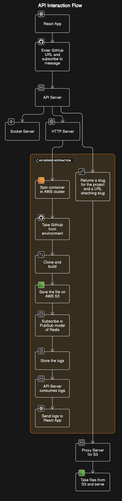

Vercle-clone allow user to deploy any react application with its public github url via just one click.
Teck stack used : Nodejs, Docker, React app, Aws ECS, Aws ECR, AWs S3, AWs Lamda , redis.

steps to setup in local

cd api
npm install
npm start

cd ..

cd s3ReverseProxy
npm install
npmstart

cd ..
vercel-clone-ui
npm install
npm run dev

browse to http://localhost:5173/

